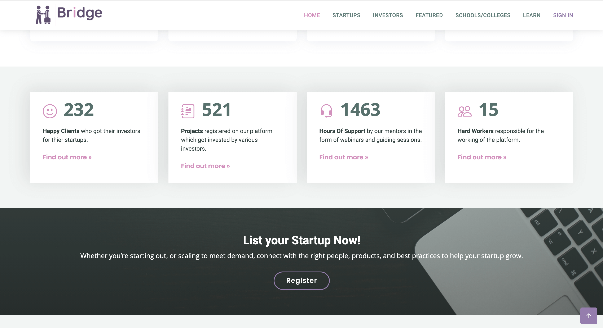

## Table of Contents
1. [Features](#features)
2. [Technologies](#technologies)
3. [Installation](#installation)

<!-- 

 -->

<!-- * A platform where startups, small or large, can list themselves and showcase their products.
* A marketplace where investors can find new and upcoming startups to invest in and follow their progress.
* A connecting medium between ideas and investments.
* A unique concept to list budding startups from schools and colleges.
* A special section for inspiring stories of startups growing from scratch.
* A learn section for amateurs as well as experts to learn and share knowledge.
* A platform to promote entrepenuership culture among school and college going students. -->

 
 

## Technologies
***
A list of technologies used within the project:
* HTML5
* CCS3
* JavaScript
* Express
* MongoDB
* NodeJs
* Mongoose
* PassportJS

